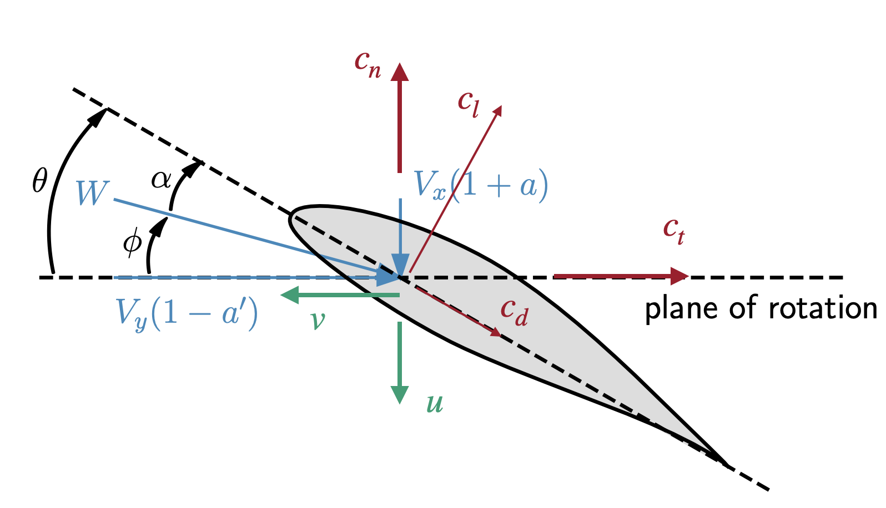

# Reference

This section describes the API in more detail.

## Input Structs

The rotor object is defined as follows.

```@docs
Rotor
```

The precone angle is shown below (commonly used with wind turbines, less so with propellers). ``\Phi`` is negative as shown.


If there is precone then the Rhub and Rtip dimensions correspond to the length along the blade (instead of the radius from the center of rotation).  That way when precone is changed, the blade just rotates instead of shearing as is more common.  The `turbine` parameter is used for wind turbines, as discussed in [Wind Turbine Operation](@ref).  The remaining options are for airfoil (and tip loss) corrections and are discussed in [Airfoil (and Tip) Corrections](@ref). 

The `Section` object is defined as follows:

```@docs
Section
```

Radius, like the hub and tip radii, follows along the blade.  Note that we usually only specify interior `r` points (e.g., strict inequalities for `Rhub < r < Rtip`).  However, CCBlade will allow you to specify points all the way to r = Rtip and/or r = Rhub, but because the loads are always zero at the hub/tip, the computation is bypassed for efficiency.  The thrust/torque integration always extrapolates to zero loads at the tip so there is no benefit to including the ends, however there is no harm either. 

Positive twist is shown below.  


Airfoils are either a function as noted in the docstring, or a subtype of `AFType`, which in discussed in more detail in [Airfoil Evaluation](@ref). 

The remaining input is the operating point:

```@docs
OperatingPoint
```
The inflow velocities ``V_x`` and ``V_y`` are seen in the figure above.  This allows to user to specify a completely general input, but usually these aren't specified directly.  Rather convenience functions are used to define these velocities across the blade (discussed below).  Dynamic viscosity is only need if the airfoil data contains multiple Reynolds number.  The speed of sound is only needed if the airfoil data contains multiple Mach numbers.  Pitch twists the entire blade in the same positive direction as twist.

A simple propeller would have ``V_x = V_\infty`` and ``V_y = \Omega r``.  That's essentially what the `simple_op` convenence function provides (with the addition of accounting for precone).  

```@docs
simple_op
```

For wind turbines, a convenience function is provided `windturbine_op` that also includes yaw, tilt, azimuth, hub height, and a shear exponent.  

```@docs
windturbine_op
```


To account for the velocity change across the hub face we compute the height of each blade location relative to the hub using coordinate transformations (where ``\Phi`` is the precone angle):
```math
  z_h = r \cos\Phi \cos\psi \cos\Theta + r \sin\Phi\sin\Theta
```
then apply the shear exponent (``\alpha``):
```math
  V_{shear} = V_{hub} \left(1 + \frac{z_h}{H_{hub}} \right)^\alpha
```
where ``H_{hub}`` is the hub height.  Finally, we can compute the x- and y-components of velocity with additional coordinate transformations:
```math
\begin{aligned}
V_x &= V_{shear} ((\cos \gamma \sin \Theta \cos \psi + \sin \gamma \sin \psi)\sin \Phi + \cos \gamma \cos \Theta \cos \Phi)\\
V_y &= V_{shear} (\cos \gamma \sin \Theta\sin \psi - \sin \gamma \cos \psi) + \Omega r \cos\Phi
\end{aligned}
```


## Output Struct

The full list of `Outputs` is as follows:

```@docs
Outputs
```

Most of these parameters are defined in the figure below.  The variables Np and Tp (where p is short for prime, as in a force per unit length) are in the cn and ct directions respectively.



When using broadcasting to retrieve multiple outputs as once (as would be commonly done for multiple sections along a blade) the return type is an array of structs.  However, the `dot` notation is overloaded so that the outputs can be accessed as if it was a struct of arrays (e.g., `outputs.Np`).  This was shown in the introductory [tutorial](tutorial.md).


One subtle notes regarding the way the tip-loss factor works.  The BEM methodology applies hub/tip losses to the loads rather than to the velocities.  This is the most common way to implement a BEM, but it means that the raw velocities may be misleading as they do not contain any hub/tip loss corrections.  To fix this we compute the effective hub/tip losses that would produce the same thrust/torque.  In other words:
``C_T = 4 a (1 + a) F = 4 a G (1 + a G)``
We solve this for G, and multiply it against the returned wake velocities ``u`` and ``v`` (but not the induction factors).  Doing so allows us to return consistent values for the wake velocities, which may be of interest when computing interactions between rotor wakes and other objects.


## Solve

Solve is the main function that takes in the three input structs (`Rotor`, `Section`, `OperatingPoint`) and returns the output struct (`Outputs`).  Often broadcasting is used to call this function at multiple sections, or multiple sections and multiple operating points.

```@docs
solve
```

## Integrated Loads

After solving, the distributed loads can be integrated to provide thrust and torque using the function `thrusttorque`.

```@docs
thrusttorque(::Any, ::Any, ::Vector{TO}) where TO
```

The method extends to loads to the hub/tip (where the loads go to zero) to capture the small contribution to thrust and torque from the ends of the `r` vector to `Rhub` and `Rtip`.

There is also an overloaded version where a matrix of outputs is input for azimuthal averaging (mainly used for wind turbines).

```@docs
thrusttorque(::Any, ::Any, ::Matrix{TO}) where TO
```

Often we want to nondimensionalize the outputs.  The nondimensionalization uses different conventions depending on the name assigned in `rotortype`.  

```@docs
nondim
```

For `rotortype = "windturbine"` the following outputs are returned:

```math
\begin{aligned}
C_P &= \frac{P}{q A V_{hub}}\\
C_T &= \frac{T}{q A}\\
C_Q &= \frac{Q}{q R_{disk} A}\\
\end{aligned}
```

where
```math
\begin{aligned}
R_{disk} &= R_{tip} \cos(\text{precone})\\
A &= \pi R_{disk}^2\\
q &= \frac{1}{2}\rho V_{hub}^2\\
\end{aligned}
```

For `type = "propeller"` the return outputs are:
```math
\begin{aligned}
\eta &= \frac{T V_{hub}}{P}\\
C_T &= \frac{T}{\rho n^2 D^4}\\
C_Q &= \frac{Q}{\rho n^2 D^5}\\
\end{aligned}
```
where
```math
\begin{aligned}
D &= 2 R_{disk}\\
n &= \frac{\Omega}{2\pi}
\end{aligned}
```

For `type = "helicopter"` the return outputs are:
```math
\begin{aligned}
FM &= \frac{C_T^{3/2}}{\sqrt{2} C_P}\\
C_T &= \frac{T}{\rho A (\Omega R_{disk})^2}\\
C_P &= \frac{P}{\rho A (\Omega R_{disk})^3}\\
\end{aligned}
```
note that with this definition `C_Q = C_P`.

 ## Airfoil Evaluation

 The main airfoil evaluation function is `afeval`.

 ```@docs
afeval(::CCBlade.AFType, ::Any, ::Any, ::Any)
```

It dispatches based on subtypes of `AFType` or any `Function` of the form noted in the docstring.  Several subtypes of `AFType` are implemented.  The first is `SimpleAF`.

```@docs
SimpleAF
```

This form is mostly useful for testing, or really simple analyse.  Next, and perhaps the most common type is `AlphaAF`. This type takes in arrays of data and creates an Akima spline with variation just in angle of attack.  It can also be initialized from a file (format discussed below).  

```@docs
AlphaAF
```

Similar forms exist for variation with angle of attack and Reynolds number:

```@docs
AlphaReAF
```

angle of attack and Mach number:

```@docs
AlphaMachAF
```

and all three (angle of attack, Reynolds number, Mach number):

```@docs
AlphaReMachAF
```

More generally the user can provide any function of the form `cl, cd = af(alpha, Re Mach)` or can create their own subtypes of `AFType` to be used by CCBlade.

## Airfoil Files

Because many of these formats require storing long vectors/matrices of data, it is convenient to store them in files.  There are multiple convenience methods for reading and writing files based on the implemented `AFType` subtypes.  The file format for all airfoil files is as follows:

______\
informational line (arbitrary string just for information)\
Re (float, Reynolds number data was taken at)\
Mach (float, Mach number data was taken at)\
alpha1  cl1  cd1  (columns of data separated by space for angle of attack, lift coefficient, and drag coefficient)\
alpha2  cl2  cd2\
alpha3  cl3  cd3\
...\
------

In addition to reading these in directly, you can write data to a file, which is dispatched based on the `AFType`.

```@docs
write_af
```

## Airfoil (and Tip) Corrections

Various airfoil correction methods exist for Mach number, Reynolds number, and rotation effects.  Additionally, custom tip loss corrections can be specified.  For Mach number and Reynolds number the form is similar.  For Mach number, there is the `mach_correction` function that dispatches based on subtypes of `MachCorrection`.

```@docs
mach_correction(::MachCorrection, ::Any, ::Any, ::Any)
```

For example, a Prandtl-Glauert correction is available:

```@docs
mach_correction(::PrandtlGlauert, ::Any, ::Any, ::Any)
```

Similarly, Reynolds number corrections use the `re_correction` function with dispatching based on subtypes of `ReCorrection`

```@docs
re_correction(::ReCorrection, ::Any, ::Any, ::Any)
```

A skin friction model based on flat plate increases in drag coefficient with Reynolds number is implemented:

```@docs
SkinFriction
```
For convenience, there is also `LaminarSkinFriction(Re0)` and `TurbulentSkinFriction(Re0)` to set the exponent `p` for typical values for fully laminar and fully turbulent flow respectively.

Rotational corrections for 3D stall delay use the `rotation_correction` function that dispatches on subtypes of `RotationCorrection`.

```@docs
rotation_correction
```

A supplied correction method uses the Du-Selig method for lift and the Eggers method for drag.

```@docs
DuSeligEggers
```

Finally, tip loss corrections are provided by the `tip_correction` function dispatching based on `TipCorrection`.

```@docs
tip_correction
```

Two provided corrections are Prandtl tip loss, and Prandtl tip and hub loss.

```@docs
PrandtlTip
PrandtlTipHub
```

## Airfoil Extrapolation

While not used in CCBlade directly, for convenience a preprocessing method is provided to extrapolate airfoil coefficient data from ``-\pi`` to ``\pi``.

```@docs
viterna
```