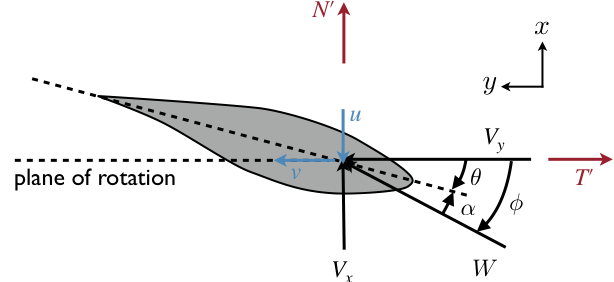
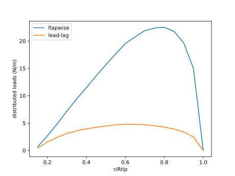
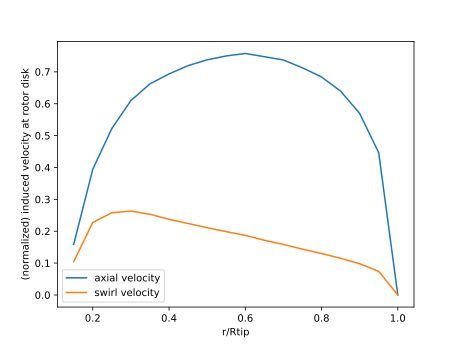
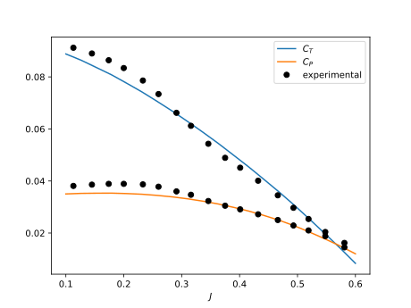

# Guide

This section contains two examples, one for a wind turbine and one for a propeller.  Each function in the module is introduced along the way.  Because the workflow for the propeller is essentially the same as that for the wind turbine (except the operating point), the propeller example does not repeat the same level of detail or comments.

To start, we import CCBlade as well as a plotting module.  I prefer to use `import` rather than `using` as it makes the namespace clear when multiple modules exist (except with plotting where it is obvious), but for the purposes of keeping this example concise I will use `using`.

All angles should be in radians.  The only exception is the airfoil input file, which has angle of attack in degrees for readability.

```@example wt
using CCBlade
using PyPlot
```

## Wind Turbine

First, we need to define the geometric parameterization.  This example approximately corresponds to the NREL 5MW reference wind turbine.  There are two structs to define the geometry, the first is for the whole rotor, and the second defines properties that vary along the blade radius.  The first is the rotor:

```@docs
Rotor
```

Rhub/Rtip define the hub and tip radius and are used for hub/tip corrections, for integration of loads, and for nondimensionalization.    The parameter `turbine` just changes the input/output conventions.  If `turbine=true` then the following positive directions for inputs, induced velocities, and loads are used as shown in the figure below.  



The definition for the precone is shown below.  Note that there is a convenience constructor where precone is omitted (defaults to zero) because while precone is often used for wind turbines it is rarely used for propellers.


Let's define these rotor properties:

```@example wt

Rhub = 1.5
Rtip = 63.0
B = 3
turbine = true
pitch = 0.0
precone = 2.5*pi/180

rotor = Rotor(Rhub, Rtip, B, turbine, pitch, precone)

nothing # hide
```

Next we need to define the section properties that vary along the blade radius.  The section object defines a single radial station:

```@docs
Section
```

Note that ``r`` is the distance along the blade, rather than in the rotor plane.  

We'll define all these properties now, except for the airfoils as those will take more explanation

```@example wt

r = [2.8667, 5.6000, 8.3333, 11.7500, 15.8500, 19.9500, 24.0500,
    28.1500, 32.2500, 36.3500, 40.4500, 44.5500, 48.6500, 52.7500,
    56.1667, 58.9000, 61.6333]
chord = [3.542, 3.854, 4.167, 4.557, 4.652, 4.458, 4.249, 4.007, 3.748,
    3.502, 3.256, 3.010, 2.764, 2.518, 2.313, 2.086, 1.419]
theta = pi/180*[13.308, 13.308, 13.308, 13.308, 11.480, 10.162, 9.011, 7.795,
    6.544, 5.361, 4.188, 3.125, 2.319, 1.526, 0.863, 0.370, 0.106]

nothing # hide
```

!!! warning
    You must have Rhub < r < Rtip for all r.  These are strict inequalities (not equal to).


The airfoil input is any function of the form: `cl, cd = airfoil(alpha, Re, Mach)` where `cl` and `cd` are the lift and drag coefficient respectively, `alpha` is the angle of attack in radians, `Re` is the Reynolds number, and `Mach` is the Mach number.  Some of the inputs can be ignored if desired (e.g., Mach number).  While users can supply any function, two convenience methods exist for creating these functions.  One takes data from files, the other uses input arrays.  Both convert the data into a smooth spline (currently an Akima spline, or recursive Akima splines in higher dimensions).

The required file format contains one header line that is ignored in parsing.  Its purpose is to allow you to record any information you want about the data in that file (e.g., where it came from, type of corrections applied, Reynolds number, etc.).  The rest of the file contains data in columns split by  whitespace (not commas) in the following order: alpha, cl, cd.  You can add additional columns of data (e.g., cm), but they will be ignored in this module.  One file corresponds to one Reynolds number and one Mach number.

For example, a simple file (a cylinder section) would look like:
```
Cylinder section with a Cd of 0.50.  Re = 1 million.
-180.0   0.000   0.5000   0.000
0.00     0.000   0.5000   0.000
180.0    0.000   0.5000   0.000
```

There are three options for constructing from files.  

```@docs
af_from_files(filenames; Re=[], Mach=[])
```

The first is a single file.  In that case the data varies only with with angle of attack.  

```
afexample = af_from_files("airfoil.dat")
```

The second case is a list of files that correspond to different Reynolds numbers, or different Mach numbers.  In this case the variation is with angle of attack and either Re or Mach.

```
afexample = af_from_files(["airfoil_Re1.dat", "airfoil_Re2.dat"], Re=[1e5, 2e5])
```

or

```
afexample = af_from_files(["airfoil_M6.dat", "airfoil_M7.dat"], Mach=[0.6, 0.7])
```

The last case is a matrix of files to allow for simultaneous variation in angle of attack, Reynolds number, and Mach number.

```
afexample = af_from_files([["af_Re1_M6.dat" "af_Re1_M68.dat" "af_Re1_M7.dat"]; 
    ["af_Re2_M6.dat" "af_Re2_M68.dat" "af_Re2_M7.dat"]], 
    Re=[1e5, 2e5], Mach=[0.6, 0.68, 0.7])
```

Alternatively, if you have the alpha, cl, cd data already in vectors you can initialize directly from the vectors:

```@docs
af_from_data(alpha, Re, Mach, cl, cd)
```

There is also a convenience method for cases with only variation in angle of attack.
```
af_from_data(alpha, cl, cd)
```

In this example, we will initialize from files since the data arrays would be rather long.  The only complication is that there are 8 different airfoils used at the 17 different radial stations so we need to assign them to the correct stations corresponding to the vector ``r`` defined previously.

```@example wt
# Define airfoils.  In this case we have 8 different airfoils that we load into an array.
# These airfoils are defined in files.
aftypes = Array{Any}(undef, 8)
aftypes[1] = af_from_files("airfoils/Cylinder1.dat")
aftypes[2] = af_from_files("airfoils/Cylinder2.dat")
aftypes[3] = af_from_files("airfoils/DU40_A17.dat")
aftypes[4] = af_from_files("airfoils/DU35_A17.dat")
aftypes[5] = af_from_files("airfoils/DU30_A17.dat")
aftypes[6] = af_from_files("airfoils/DU25_A17.dat")
aftypes[7] = af_from_files("airfoils/DU21_A17.dat")
aftypes[8] = af_from_files("airfoils/NACA64_A17.dat")

# indices correspond to which airfoil is used at which station
af_idx = [1, 1, 2, 3, 4, 4, 5, 6, 6, 7, 7, 8, 8, 8, 8, 8, 8]

# create airfoil array 
airfoils = aftypes[af_idx]

nothing # hide
```

We can now define the sections using this airfoil data.  Since Section is defined for one section, and we'd like to define them all simultaneously, we use broadcasting (see the dot after Section).

```@example wt
sections = Section.(r, chord, theta, airfoils)
nothing # hide
```

Next, we need to specify the operating conditions.  At a basic level the inflow conditions need to be defined as a struct defined by OperatingPoint.  The parameters `mu` and `asound` are optional if Reynolds number and Mach number respectively are not used in the airfoil functions.

```@docs
OperatingPoint
```

The coordinate system for Vx and Vy is shown at the top of [Wind Turbine](@ref).  In general, different inflow conditions will exist at every location along the blade. The above type allows one to specify an arbitrary input definition, however, convenience methods exist for a few typical inflow conditions.  For a typical wind turbine operating point you can use the `windturbine_op` function, which is based on the angles and equations shown below.


To account for the velocity change across the hub face we compute the height of each blade location relative to the hub using coordinate transformations (where ``\Phi`` is the precone angle):
```math
  z_h = r \cos\Phi \cos\psi \cos\Theta + r \sin\Phi\sin\Theta
```
then apply the shear exponent (``\alpha``):
```math
  V_{shear} = V_{hub} \left(1 + \frac{z_h}{H_{hub}} \right)^\alpha
```
where ``H_{hub}`` is the hub height.  Finally, we can compute the x- and y-components of velocity with additional coordinate transformations:
```math
\begin{aligned}
V_x &= V_{shear} ((\cos \gamma \sin \Theta \cos \psi + \sin \gamma \sin \psi)\sin \Phi + \cos \gamma \cos \Theta \cos \Phi)\\
V_y &= V_{shear} (\cos \gamma \sin \Theta\sin \psi - \sin \gamma \cos \psi) + \Omega r \cos\Phi
\end{aligned}
```


```@docs
windturbine_op
```

We will use this function for this example, at a tip-speed ratio of 7.55.  We again use broadcasting because the velocities will vary at each radial station `r`.

```@example wt

# operating point for the turbine
yaw = 0.0*pi/180
tilt = 5.0*pi/180
hubHt = 90.0
shearExp = 0.2

Vinf = 10.0
tsr = 7.55
rotorR = Rtip*cos(precone)
Omega = Vinf*tsr/rotorR
azimuth = 0.0*pi/180
rho = 1.225

op = windturbine_op.(Vinf, Omega, r, precone, yaw, tilt, azimuth, hubHt, shearExp, rho)

nothing # hide
```

We have now defined the requisite inputs and can start using the BEM methodology.  The solve function is the core of the BEM.

```@docs
solve
```

The output result is a struct defined below. The positive directions for the normal and tangential forces, and the induced velocities are shown at the top of [Wind Turbine](@ref).

```@docs
Outputs
```

Note that we use broadcasting to solve all sections in one call.  However, since rotor is not an Array, we wrap it in Ref so that it can broadcast as a "scalar".

```@example wt
out = solve.(Ref(rotor), sections, op)

nothing # hide
```

There are many outputs, and although the return variable is an array of structs, convenience methods are provided to access the fields as if it was a struct of arrays.  For example, we can access the angles of attack as:

```@example wt
out.alpha
```

Let's now plot the distributed loads.


```@example wt
# plot distributed loads
figure()
plot(r/Rtip, out.Np/1e3)
plot(r/Rtip, out.Tp/1e3)
xlabel("r/Rtip")
ylabel("distributed loads (kN/m)")
legend(["flapwise", "lead-lag"])
savefig("loads-turbine.svg"); nothing # hide
```


We are likely also interested in integrated loads, like thrust and torque, which are provided by the function `thrusttorque`.

```@docs
thrusttorque
```

```@example wt
T, Q = thrusttorque(rotor, sections, out)
```

As used in the above example, this would give the thrust and torque assuming the inflow conditions were constant with azimuth (overly optimistic with this case at azimuth=0).  If one wanted to compute thrust and torque using azimuthal averaging you would compute multiple inflow conditions with different azimuth angles and then average the resulting forces.  This can be conveniently done with broadcasting.  

To do this we are broadcast across `r` and `az_angles` as a matrix of conditions. We will transpose `az_angles` into a row vector to make this happen.  If uncomforable with broadcasting, all of these could all be done easily with for loops.  The `thrusttorque` function is overloaded with a version that accepts a matrix of outputs where outputs[i, j] corresponds to r[i], azimuth[j] then performs an integration using averaging across the azimuthal conditions.


```@example wt
azangles = pi/180*[0.0, 90.0, 180.0, 270.0]
ops = windturbine_op.(Vinf, Omega, r, precone, yaw, tilt, azangles', hubHt, shearExp, rho)
outs = solve.(Ref(rotor), sections, ops)

T, Q = thrusttorque(rotor, sections, outs)
```

One final convenience function is to nondimensionalize the outputs.  The nondimensionalization uses different conventions depending on the application.  For a wind turbine the nondimensionalization is:

```math
\begin{aligned}
C_T &= \frac{T}{q A}\\
C_Q &= \frac{Q}{q R_{disk} A}\\
C_P &= \frac{P}{q A V_{hub}}\\
\end{aligned}
```

where
```math
\begin{aligned}
R_{disk} &= R_{tip} \cos(\text{precone})\\
A &= \pi R_{disk}^2\\
q &= \frac{1}{2}\rho V_{hub}^2\\
\end{aligned}
```

```@docs
nondim
```

```@example wt
CP, CT, CQ = nondim(T, Q, Vinf, Omega, rho, rotor)

```

As a final example, let's create a nondimensional power curve for this turbine (power coefficient vs tip-speed-ratio):

```@example wt
ntsr = 20  # number of tip-speed ratios
tsrvec = range(2, 15, length=ntsr)
cpvec = zeros(ntsr)  # initialize arrays
ctvec = zeros(ntsr)

azangles = pi/180*[0.0, 90.0, 180.0, 270.0]

for i = 1:ntsr
    Omega = Vinf*tsrvec[i]/rotorR

    ops = windturbine_op.(Vinf, Omega, r, precone, yaw, tilt, azangles', hubHt, shearExp, rho)
    outs = solve.(Ref(rotor), sections, ops)
    T, Q = thrusttorque(rotor, sections, outs)

    cpvec[i], ctvec[i], _ = nondim(T, Q, Vinf, Omega, rho, rotor)
end

figure()
plot(tsrvec, cpvec)
plot(tsrvec, ctvec)
xlabel("tip speed ratio")
legend([L"C_P", L"C_T"])
savefig("cpct-turbine.svg"); nothing # hide
```


## Propellers

The propeller analysis follows a very similar format.  The areas that are in common will not be repeated, only differences will be highlighted.

```@setup prop
using CCBlade
using PyPlot
```

Again, we first define the geometry, including the airfoils (which are the same along the blade in this case).  The positive conventions for a propeller (`turbine=false`) are shown in the figure below.  The underlying theory is unified across the two methods, but the input/output conventions differ to match common usage in the respective domains.


```@example prop

# rotor definition
Rhub = 0.0254*.5
Rtip = 0.0254*3.0
B = 2  # number of blades
turbine = false

r = .0254*[0.7526, 0.7928, 0.8329, 0.8731, 0.9132, 0.9586, 1.0332,
     1.1128, 1.1925, 1.2722, 1.3519, 1.4316, 1.5114, 1.5911,
     1.6708, 1.7505, 1.8302, 1.9099, 1.9896, 2.0693, 2.1490, 2.2287,
     2.3084, 2.3881, 2.4678, 2.5475, 2.6273, 2.7070, 2.7867, 2.8661, 2.9410]
chord = .0254*[0.6270, 0.6255, 0.6231, 0.6199, 0.6165, 0.6125, 0.6054, 0.5973, 0.5887,
          0.5794, 0.5695, 0.5590, 0.5479, 0.5362, 0.5240, 0.5111, 0.4977,
          0.4836, 0.4689, 0.4537, 0.4379, 0.4214, 0.4044, 0.3867, 0.3685,
          0.3497, 0.3303, 0.3103, 0.2897, 0.2618, 0.1920]
theta = pi/180.0*[40.2273, 38.7657, 37.3913, 36.0981, 34.8803, 33.5899, 31.6400,
                   29.7730, 28.0952, 26.5833, 25.2155, 23.9736, 22.8421, 21.8075,
                   20.8586, 19.9855, 19.1800, 18.4347, 17.7434, 17.1005, 16.5013,
                   15.9417, 15.4179, 14.9266, 14.4650, 14.0306, 13.6210, 13.2343,
                   12.8685, 12.5233, 12.2138]

af = af_from_files("airfoils/NACA64_A17.dat")
airfoils = fill(af, length(r))

rotor = Rotor(Rhub, Rtip, B, turbine)
sections = Section.(r, chord, theta, airfoils)
nothing # hide
```

Next, we define the operating point.  For a propeller, it typically doesn't operate with tilt, yaw, and shear like a wind turbine does, so we have defined another convenience function for simple uniform inflow.  Like before, you can always define your own arbitrary inflow object.

```@docs
simple_op
```

In this example, we assume simple inflow, and broadcast across the different radial stations.  

```@example prop

rho = 1.225
Vinf = 10.0
Omega = 8000.0*pi/30.0

op = simple_op.(Vinf, Omega, r, rho)
nothing # hide
```

We can now computed distributed loads and induced velocities.  

```@example prop
outputs = solve.(Ref(rotor), sections, op)

figure()
plot(r/Rtip, outputs.Np)
plot(r/Rtip, outputs.Tp)
xlabel("r/Rtip")
ylabel("distributed loads (N/m)")
legend(["flapwise", "lead-lag"])
savefig("loads-prop.svg"); nothing # hide
```




This time we will also look at the induced velocities.  This is usually not of interest for wind turbines, but for propellers can be useful to assess, for example, prop-on-wing interactions.  These wake velocities have hub/tip corrections applied, whereas intermediate calculations like `a` do not.  Thus: `u` does not equal `Vx * a`.

```@example prop
figure()
plot(r/Rtip, outputs.u/Vinf)
plot(r/Rtip, outputs.v/Vinf)
xlabel("r/Rtip")
ylabel("(normalized) induced velocity at rotor disk")
legend(["axial velocity", "swirl velocity"])
savefig("velocity-prop.svg"); nothing # hide
```




As before, we'd like to evaluate integrated quantities at multiple conditions in a for loop (advance ratios as is convention for propellers instead of tip-speed ratios).  The normalization conventions for a propeller are:

```math
\begin{aligned}
C_T &= \frac{T}{\rho n^2 D^4}\\
C_Q &= \frac{Q}{\rho n^2 D^5}\\
C_P &= \frac{P}{\rho n^3 D^5} = \frac{C_Q}{2 \pi}\\
\eta &= \frac{C_T J}{C_P}
\end{aligned}
```
where
```math
\begin{aligned}
n &= \frac{\Omega}{2\pi} \text{ rev per sec}\\
D &= 2 R_{tip} \cos(\text{precone})\\
J &= \frac{V}{n D}
\end{aligned}
```

!!! note
    Efficiency is set to zero if the thrust is negative (producing drag).  

The code below performs this analysis then plots thrust coefficient, power coefficient, and efficiency as a function of advance ratio.


```@example prop
nJ = 20  # number of advance ratios

J = range(0.1, 0.9, length=nJ)  # advance ratio

Omega = 8000.0*pi/30
n = Omega/(2*pi)
D = 2*Rtip

eff = zeros(nJ)
CT = zeros(nJ)
CQ = zeros(nJ)

for i = 1:nJ
    Vinf = J[i] * D * n

    op = simple_op.(Vinf, Omega, r, rho)
    outputs = solve.(Ref(rotor), sections, op)
    T, Q = thrusttorque(rotor, sections, outputs)
    eff[i], CT[i], CQ[i] = nondim(T, Q, Vinf, Omega, rho, rotor)

end

figure()
plot(J, CT)
plot(J, CQ*2*pi)
xlabel(L"J")
legend([L"C_T", L"C_P"])
savefig("ctcp-prop.svg") # hide

figure()
plot(J, eff)
xlabel(L"J")
ylabel(L"\eta")
savefig("eta-prop.svg"); nothing # hide
```




## Derivatives

To code is written in a generic enough way to allow for algorithmic differentiation through the entirety of the code.  This derivative workflow is not embeded in the package for a few reasons: 1) there are many different possible input/output combinations and trying to handle the most general cases would create a lot of extra data that may not be of interest, 2) there are many different AD packages one might want to use, 3) the code is often connected to others and one might want to AD a longer chain than just around CCBlade.  In any case, setting this is up is not too difficult.  Below is an example using `ForwardDiff` and `ReverseDiff`.

First, let's import some needed packages.

```@example deriv
import ForwardDiff
import ReverseDiff
using CCBlade
```

Next, let's define the data for a simple propeller geometry.

```@example deriv

D = 1.6
R = D/2.0
Rhub = 0.01
Rtip = D/2
r = range(R/10, stop=9/10*R, length=11)
chord = 0.1*ones(length(r))
proppitch = 1.0  # pitch distance in meters.
theta = atan.(proppitch./(2*pi*r))

function affunc(alpha, Re, M)

    cl = 6.2*alpha
    cd = 0.008 - 0.003*cl + 0.01*cl*cl

    return cl, cd
end 

n = length(r)
airfoils = fill(affunc, n)

B = 2  # number of blades
turbine = false
pitch = 0.0
precone = 0.0

rho = 1.225
Vinf = 30.0
RPM = 2100
Omega = RPM * pi/30 

nothing # hide
```

Both `ForwardDiff` and `ReverseDiff` expect a function with a vector input and a vector output.  So we will need to create a wrapper function that takes in a vector x, which we parse into the variables of interest.  In this case we will compute thrust and torque.  This of course can be customized to any outputs of interest.  A few parameters: `af, B, turbine` are discrete, and cannot be differentiated, so we allow them to passthrough from the outer scope.  This part would be best wrapped in a function, rather than coming from global scope, but we're not worried about performance for this example.

```@example deriv

# parameters that passthrough: af, B, turbine
function ccbladewrapper(x)
    
    # unpack
    nall = length(x)
    nvec = nall - 7
    n = nvec ÷ 3

    r = x[1:n]
    chord = x[n+1:2*n]
    theta = x[2*n+1:3*n]
    Rhub = x[3*n+1]
    Rtip = x[3*n+2]
    pitch = x[3*n+3]
    precone = x[3*n+4]
    Vinf = x[3*n+5]
    Omega = x[3*n+6]
    rho = x[3*n+7]

    rotor = Rotor(Rhub, Rtip, B, turbine, pitch, precone)
    sections = Section.(r, chord, theta, airfoils)
    ops = simple_op.(Vinf, Omega, r, rho)

    outputs = solve.(Ref(rotor), sections, ops)

    T, Q = thrusttorque(rotor, sections, outputs)

    return [T; Q]
end

nothing # hide
```

We can now evaluate the Jacobian using forward mode AD.

```@example deriv

x = [r; chord; theta; Rhub; Rtip; pitch; precone; Vinf; Omega; rho]
J = ForwardDiff.jacobian(ccbladewrapper, x)
```

The Jacobian in this case is a 2 x 40 matrix because we have 2 outputs and 40 inputs.

We could calculate the Jacobian with reverse mode AD instead.  Note that below is not the most efficient way to evaluate in reverse mode, especially if the derivatives will be computed repeatedly for more inputs (see `ReverseDiff` documentation).

```@example deriv
J2 = ReverseDiff.jacobian(ccbladewrapper, x)
```

We can check that these matricies are nearly identical:

```@example deriv
println(maximum(abs.(J - J2)))
```

Generally, we should compare these derivatives against complex step, but the code is not currently complex safe, so we'll instead compare against central differencing.

```@example deriv

import FLOWMath
import Statistics: mean
J3 = FLOWMath.centraldiff(ccbladewrapper, x)

println(maximum(abs.(J - J3)))
println(mean(abs.(J - J3)))
```

We can't expect as high of accuracy in comparing these Jacobians due to the limitations of finite differencing.

The Jacobian is in terms of f (outputs) vs x (inputs).  For example, if wanted to know dT/dchord we would use the same indexing we used when parsing `x`:


```@example deriv

dTdchord = J[1, n+1:2*n]
```

## Derivatives with OpenMDAO.jl

[OpenMDAO](https://openmdao.org) is a great platform, particularly for computing system level derivatives across multiple components.  We've created a small Julia wrapper to OpenMDAO called [OpenMDAO.jl](https://github.com/byuflowlab/OpenMDAO.jl).  CCBlade contains a nested solve (Brent's method), and in the above example, we've just use AD through the solve.  That works fine, and is actually more efficient in this case, but for larger internal solves is usually less efficient.  This example acts as an example of how to use OpenMDAO.jl, and assumes prior experience with OpenMDAO.

First, we import the modules we need.  We import OpenMDAO rather than `using` in order to make all the calls explicit.  We will use `ForwardDiff` to compute the partial derivatives. We import `diag` in order to extract the diagonal part of the Jacobian (this could be more efficient by not computing those off-diagonal parts in the first place, but sparse Jacobians are not yet supported in `ForwardDiff`).

```@example openmdao

using CCBlade
import OpenMDAO
import ForwardDiff
import LinearAlgebra: diag
```

Next, we define a type.  The type's main purpose is dispatch, but can also be used to define fixed parameters, or "options" using the OpenMDAO vocabulary.  In this case we are going to create an implicit component because of the nested solve.

```@example openmdao
struct RotorComp{TAF, TI, TB} <: OpenMDAO.AbstractImplicitComp
    af::TAF
    B::TI
    turbine::TB
end
```

Now we define the setup function, dispatching based on our type.  The input/output data is expected to be in arrays, even for size 1, because it allows for easier data passing between Julia/Python.  If you leave off shape and val the default is a scalar.  In the below example, four of the partial derivatives have sparse Jacobians (diagonal in this case).  The indices must be specified using Python syntax (0-based).  In this case there are n residuals associated with phi.  The other two scalar outputs are explicitly known but are included for convenience.

```@example openmdao

function OpenMDAO.setup(rc::RotorComp)
 
    n = length(rc.af)

    inputs = [
        OpenMDAO.VarData("r", shape=[n], val=ones(n)),
        OpenMDAO.VarData("chord", shape=[n], val=ones(n)),
        OpenMDAO.VarData("theta", shape=[n], val=ones(n)),
        OpenMDAO.VarData("Rhub"),
        OpenMDAO.VarData("Rtip"),
        OpenMDAO.VarData("pitch"),
        OpenMDAO.VarData("precone"),
        OpenMDAO.VarData("Vinf"),
        OpenMDAO.VarData("Omega"),
        OpenMDAO.VarData("rho")
    ]

    outputs = [
        OpenMDAO.VarData("phi", shape=[n], val=ones(n)),
        OpenMDAO.VarData("T", shape=[1], val=[1.0]),
        OpenMDAO.VarData("Q", shape=[1], val=[1.0])
    ]

    idx = range(0, n-1, step=1)
    partials = [
        OpenMDAO.PartialsData("phi", "r", rows=idx, cols=idx),
        OpenMDAO.PartialsData("phi", "chord", rows=idx, cols=idx),
        OpenMDAO.PartialsData("phi", "theta", rows=idx, cols=idx),
        OpenMDAO.PartialsData("phi", "phi", rows=idx, cols=idx),
        OpenMDAO.PartialsData("phi", "Rhub"),
        OpenMDAO.PartialsData("phi", "Rtip"),
        OpenMDAO.PartialsData("phi", "pitch"),
        OpenMDAO.PartialsData("phi", "precone"),
        OpenMDAO.PartialsData("phi", "Vinf"),
        OpenMDAO.PartialsData("phi", "Omega"),
        OpenMDAO.PartialsData("phi", "rho"),
        OpenMDAO.PartialsData("phi", "T"),
        OpenMDAO.PartialsData("phi", "Q"),
        OpenMDAO.PartialsData("T", "r"),
        OpenMDAO.PartialsData("T", "chord"),
        OpenMDAO.PartialsData("T", "theta"),
        OpenMDAO.PartialsData("T", "phi"),
        OpenMDAO.PartialsData("T", "Rhub"),
        OpenMDAO.PartialsData("T", "Rtip"),
        OpenMDAO.PartialsData("T", "pitch"),
        OpenMDAO.PartialsData("T", "precone"),
        OpenMDAO.PartialsData("T", "Vinf"),
        OpenMDAO.PartialsData("T", "Omega"),
        OpenMDAO.PartialsData("T", "rho"),
        OpenMDAO.PartialsData("T", "T"),
        OpenMDAO.PartialsData("T", "Q"),
        OpenMDAO.PartialsData("Q", "r"),
        OpenMDAO.PartialsData("Q", "chord"),
        OpenMDAO.PartialsData("Q", "theta"),
        OpenMDAO.PartialsData("Q", "phi"),
        OpenMDAO.PartialsData("Q", "Rhub"),
        OpenMDAO.PartialsData("Q", "Rtip"),
        OpenMDAO.PartialsData("Q", "pitch"),
        OpenMDAO.PartialsData("Q", "precone"),
        OpenMDAO.PartialsData("Q", "Vinf"),
        OpenMDAO.PartialsData("Q", "Omega"),
        OpenMDAO.PartialsData("Q", "rho"),
        OpenMDAO.PartialsData("Q", "T"),
        OpenMDAO.PartialsData("Q", "Q")
    ]

    return inputs, outputs, partials
end
```

OpenMDAO is going to require providing the residuals for a given set of inputs.  Since we will also need derivatives of the residuals we will reuse these same computations and so I pull it out into a convenience function.  In this case where we are computing the residuals at all n stations at once we add a for loop.  The multiplicatation of `phi[i]*one(Vinf)` is just to ensure that `phi` has the write type when using AD later.

```@example openmdao

function instantaneous_thrusttorque(Rhub, Rtip, B, turbine, pitch, precone,
        r, chord, theta, af, Vinf, Omega, rho, phi)

    rotor = Rotor(Rhub, Rtip, B, turbine, pitch, precone)
    sections = Section.(r, chord, theta, af)
    ops = simple_op.(Vinf, Omega, r, rho)

    R = Vector{eltype(Vinf)}(undef, n)
    out = Vector{Outputs{eltype(Vinf)}}(undef, n)
    for i = 1:n
        R[i], out[i] = CCBlade.residual(phi[i]*one(Vinf), rotor, sections[i], ops[i])
    end

    T, Q = thrusttorque(rotor, sections, out)

    return R, T, Q
end

nothing # hide
```

We can now write the apply_nonlinear method for OpenMDAO dispatching based no our type.  Because OpenMDAO.jl uses arrays in communicating via python we are indexing them, `[1]`, so that scalars are passed through.  We then set the residuals.  The residuals for thrust and torque are simple as these are explicit calculations that will match the outputs.  We need to use the dot syntax when assigning residuals because we are modifying arrays in place.

```@example openmdao

function OpenMDAO.apply_nonlinear!(rc::RotorComp, inputs, outputs, residuals)

    R, T, Q = instantaneous_thrusttorque(inputs["Rhub"][1], inputs["Rtip"][1], rc.B, rc.turbine, inputs["pitch"][1], inputs["precone"][1],
        inputs["r"], inputs["chord"], inputs["theta"], rc.af, inputs["Vinf"][1], inputs["Omega"][1], inputs["rho"][1],
        outputs["phi"])

    residuals["phi"] .= R
    residuals["T"] .= T .- outputs["T"]
    residuals["Q"] .= Q .- outputs["Q"]

end
```

We now provide the partial derivatives of this function.  We do this similar to what we did with AD before, except this time we take only partial derivatives of the residuals (i.e., we did not differentiate through the solve).

```@example openmdao

function OpenMDAO.linearize!(rc::RotorComp, inputs, outputs, partials)

    B = rc.B
    turbine = rc.turbine
    af = rc.af
  
    function ccbladewrapper2(x)
    
        # unpack
        nall = length(x)
        nvec = nall - 7
        n = nvec ÷ 4

        r = x[1:n]
        chord = x[n+1:2*n]
        theta = x[2*n+1:3*n]
        phi = x[3*n+1:4*n]
        Rhub = x[4*n+1]
        Rtip = x[4*n+2]
        pitch = x[4*n+3]
        precone = x[4*n+4]
        Vinf = x[4*n+5]
        Omega = x[4*n+6]
        rho = x[4*n+7]

        R, T, Q = instantaneous_thrusttorque(Rhub, Rtip, B, turbine, pitch, precone,
            r, chord, theta, af, Vinf, Omega, rho, phi)

        return [R; T; Q]
    end

    x = [inputs["r"]; inputs["chord"]; inputs["theta"]; outputs["phi"]; inputs["Rhub"]; inputs["Rtip"]; 
        inputs["pitch"]; inputs["precone"]; inputs["Vinf"]; inputs["Omega"]; inputs["rho"]]

    J = ForwardDiff.jacobian(ccbladewrapper2, x)

    n = length(inputs["r"])
    partials["phi", "r"] .= diag(J[1:n, 1:n])
    partials["phi", "chord"] .= diag(J[1:n, n+1:2*n])
    partials["phi", "theta"] .= diag(J[1:n, 2*n+1:3*n])
    partials["phi", "phi"] .= diag(J[1:n, 3*n+1:4*n])
    partials["phi", "Rhub"] .= J[1:n, 4*n+1]
    partials["phi", "Rtip"] .= J[1:n, 4*n+2]
    partials["phi", "pitch"] .= J[1:n, 4*n+3]
    partials["phi", "precone"] .= J[1:n, 4*n+4]
    partials["phi", "Vinf"] .= J[1:n, 4*n+5]
    partials["phi", "Omega"] .= J[1:n, 4*n+6]
    partials["phi", "rho"] .= J[1:n, 4*n+7]
    partials["phi", "T"] .= 0.0
    partials["phi", "Q"] .= 0.0

    partials["T", "r"] .= J[n+1, 1:n]'
    partials["T", "chord"] .= J[n+1, n+1:2*n]'
    partials["T", "theta"] .= J[n+1, 2*n+1:3*n]'
    partials["T", "phi"] .= J[n+1, 3*n+1:4*n]'
    partials["T", "Rhub"] .= J[n+1, 4*n+1]'
    partials["T", "Rtip"] .= J[n+1, 4*n+2]'
    partials["T", "pitch"] .= J[n+1, 4*n+3]'
    partials["T", "precone"] .= J[n+1, 4*n+4]'
    partials["T", "Vinf"] .= J[n+1, 4*n+5]'
    partials["T", "Omega"] .= J[n+1, 4*n+6]'
    partials["T", "rho"] .= J[n+1, 4*n+7]'
    partials["T", "T"] .= -1.0
    partials["T", "Q"] .= 0.0

    partials["Q", "r"] .= J[n+2, 1:n]'
    partials["Q", "chord"] .= J[n+2, n+1:2*n]'
    partials["Q", "theta"] .= J[n+2, 2*n+1:3*n]'
    partials["Q", "phi"] .= J[n+2, 3*n+1:4*n]'
    partials["Q", "Rhub"] .= J[n+2, 4*n+1]'
    partials["Q", "Rtip"] .= J[n+2, 4*n+2]'
    partials["Q", "pitch"] .= J[n+2, 4*n+3]'
    partials["Q", "precone"] .= J[n+2, 4*n+4]'
    partials["Q", "Vinf"] .= J[n+2, 4*n+5]'
    partials["Q", "Omega"] .= J[n+2, 4*n+6]'
    partials["Q", "rho"] .= J[n+2, 4*n+7]'
    partials["Q", "T"] .= 0.0
    partials["Q", "Q"] .= -1.0

end

```

We could let OpenMDAO solve this system, but we have an efficient solver specific to this problem in place already and so will implement the `solve_nonlinear` method ourselves.

```@example openmdao
function OpenMDAO.solve_nonlinear!(rc::RotorComp, inputs, outputs)

    rotor = Rotor(inputs["Rhub"][1], inputs["Rtip"][1], rc.B, rc.turbine, inputs["pitch"][1], inputs["precone"][1])
    sections = Section.(inputs["r"], inputs["chord"], inputs["theta"], rc.af)
    ops = simple_op.(inputs["Vinf"][1], inputs["Omega"][1], inputs["r"], inputs["rho"][1])

    out = solve.(Ref(rotor), sections, ops)
    T, Q = thrusttorque(rotor, sections, out)

    outputs["phi"] .= out.phi
    outputs["T"] .= T
    outputs["Q"] .= Q
end
```

Now we are ready to solve the system and its derivatives.  We use the same example as the AD case.

```@example openmdao

D = 1.6
R = D/2.0
Rhub = 0.01
Rtip = D/2
r = range(R/10, stop=9/10*R, length=11)
chord = 0.1*ones(length(r))
proppitch = 1.0  # pitch distance in meters.
theta = atan.(proppitch./(2*pi*r))

function affunc(alpha, Re, M)

    cl = 6.2*alpha
    cd = 0.008 - 0.003*cl + 0.01*cl*cl

    return cl, cd
end 

n = length(r)
airfoils = fill(affunc, n)

B = 2  # number of blades
turbine = false
pitch = 0.0
precone = 0.0

rho = 1.225
Vinf = 30.0
RPM = 2100
Omega = RPM * pi/30 

nothing # hide
```

Now we use the OpenMDAO API (we are directly calling the Python module) to create the problem and run it.  This follows exactly the syntax in OpenMDAO, except we need to use the `make_component` function to transform the Julia struct into a Python object.

```@example openmdao

prob = OpenMDAO.om.Problem()

ivc = OpenMDAO.om.IndepVarComp()
ivc.add_output("r", r)
ivc.add_output("chord", chord)
ivc.add_output("theta", theta)
ivc.add_output("Rhub", Rhub)
ivc.add_output("Rtip", Rtip)
ivc.add_output("pitch", pitch)
ivc.add_output("precone", precone)
ivc.add_output("Vinf", Vinf)
ivc.add_output("Omega", Omega)
ivc.add_output("rho", rho)
prob.model.add_subsystem("ivc", ivc, promotes=["*"])

comp = OpenMDAO.make_component(RotorComp(airfoils, B, turbine))
prob.model.add_subsystem("rotorresid", comp, promotes=["*"])

prob.model.linear_solver = OpenMDAO.om.DirectSolver()

prob.setup()
prob.run_model()

nothing #hide
```

We can extract all the same partial derivatives that we got in the AD case.

```@example openmdao

J = prob.compute_totals(of=["T", "Q"], wrt=["r", "chord", "theta", "Rhub", "Rtip", "pitch", "precone", "Vinf", "Omega", "rho"])
```

Using BenchmarkTools shows that the AD version is 4x faster than the OpenMDAO.jl version, but is not likely to be faster for more complex solves.