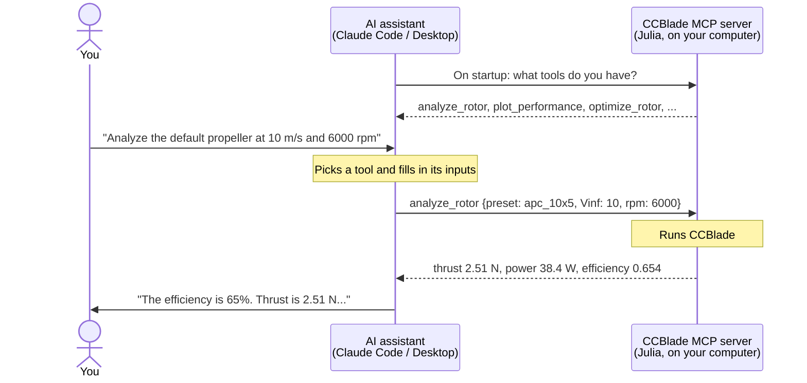

# CCBlade MCP server

Ask an AI assistant about propellers, rotors and wind turbines in plain English, and
have it run [CCBlade](https://github.com/byuflowlab/CCBlade.jl) for you. You don't need
to write any Julia.

> "Plot efficiency versus advance ratio for the default propeller at 5400 rpm. Where does it peak?"

## How it works

[MCP](https://modelcontextprotocol.io) (Model Context Protocol) is a standard way for
an AI assistant to use tools running on your own computer. This folder is one such tool
server: it wraps CCBlade in a set of tools like `analyze_rotor` and `plot_performance`.



The AI decides which tool to call and explains the result. The numbers come from
CCBlade running on your machine, not from the AI.

## Setup (once, about 15 minutes)

You need [Julia](https://julialang.org/downloads/) 1.10 or newer and an MCP client
such as [Claude Code](https://claude.com/claude-code) or Claude Desktop.

**1. Get the code and install packages.**

```bash
git clone https://github.com/byuflowlab/CCBlade.jl.git
cd CCBlade.jl
git checkout mcp-demo
./mcp/setup.sh
```

The first run takes 5 to 15 minutes, mostly precompiling. It ends with a self-check.

**2. Connect your AI assistant.** Run this to print the exact command for your
machine:

```bash
./mcp/print_client_config.sh
```

- **Claude Code:** run the `claude mcp add ...` line it prints.
- **Claude Desktop:** go to Settings > Developer > Edit Config, paste in the JSON it
  prints, and restart the app.

**3. Check the connection.** In Claude Code, type `/mcp` and look for `ccblade` with
the status "connected". In Claude Desktop, the tools appear under the tools icon in a
new chat.

## Try it

Start from one of the built-in rotors:

| Preset | What it is |
|---|---|
| `apc_10x5` | 10 inch, 2-blade hobby propeller (the default) |
| `nasa_hover_rotor` | 3-blade helicopter rotor in hover |
| `nrel_5mw` | NREL 5 MW wind turbine, 126 m diameter |

Some prompts to start with:

- "What rotor presets are available?"
- "Analyze the default propeller at 10 m/s and 6000 rpm. What's the efficiency?"
- "Plot efficiency versus advance ratio from 0.1 to 0.8 at 5400 rpm."
- "Same propeller with 3 blades. How does peak efficiency change?"
- "Show the spanwise loads and angle of attack at the peak efficiency point."
- "Redesign the chord and twist to minimize power at 3 N of thrust, 10 m/s and 5400 rpm."
- "Plot CP versus tip speed ratio for the NREL 5 MW turbine at 10 m/s."
- "I measured 4.2 N and 45 W at 6000 rpm on a 10 inch prop at 8 m/s. What are CT, CP and J?"
- "Export the optimized blade for ParaView."

You can also describe your own blade by giving its radius, chord and twist.

Plots and ParaView files are saved in `mcp/output/`, and the assistant tells you the
file path.

## What it can do

| Tool | Does |
|---|---|
| `list_presets`, `list_airfoils` | Show the built-in rotors and airfoil data |
| `analyze_rotor` | Thrust, torque, power and efficiency at one operating point |
| `sweep_rotor` | The same, over a range of rpm, speed, advance ratio or pitch |
| `plot_performance`, `plot_geometry`, `plot_spanwise`, `plot_airfoil` | Plots |
| `optimize_rotor` | Redesign chord and twist to meet a thrust or power target |
| `convert_rotor_units` | Convert between coefficients and dimensional values |
| `export_blade_vtk` | 3D blade file for ParaView |

All inputs and outputs are in SI units, with angles in degrees.

## If something goes wrong

- **Server shows "failed" or "timed out".** Julia can take longer to start than the
  client is willing to wait, especially the first time. Run `./mcp/smoke_test.sh` once
  to warm it up, then reconnect (`/mcp` in Claude Code, or restart Claude Desktop). In
  Claude Code, you can also start it with a longer timeout: `MCP_TIMEOUT=120000 claude`.
- **Wrong Julia version.** MCP clients don't read your shell setup, so the config needs
  the full path to Julia. Re-run with `JULIA=/path/to/julia ./mcp/print_client_config.sh`.
- **Check the server without an AI.** `./mcp/smoke_test.sh` calls every tool and should
  finish without errors.

## More

- [DEVELOPING.md](DEVELOPING.md): code layout, tests, adding tools, HTTP mode, and the
  Pluto notebook.
- [DEMO.md](DEMO.md): notes for presenting this in a talk or training.
